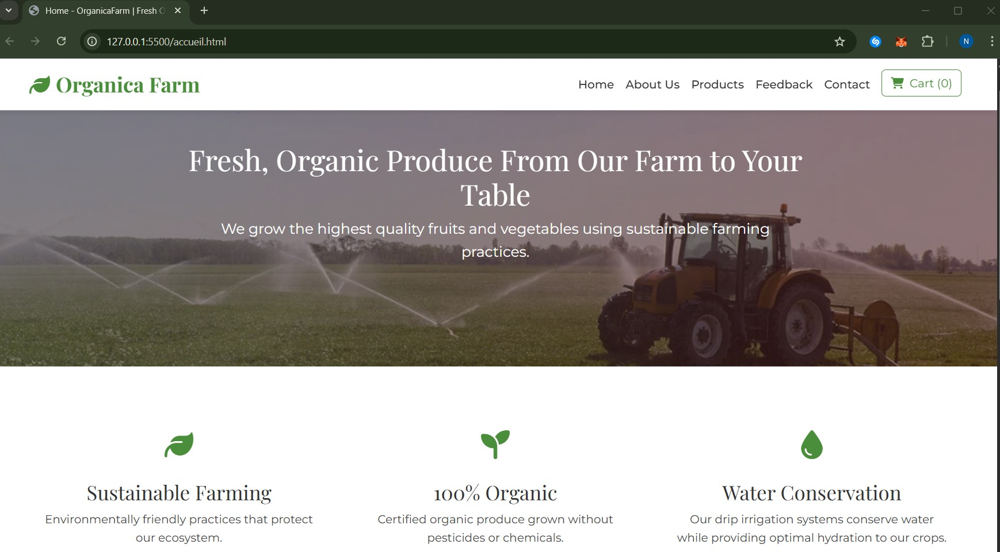

# OrganicaFarm - Organic Products Website

A modern, fully responsive organic farm website showcasing fresh fruits and vegetables with a professional e-commerce experience.
---
## 📷 Screenshots

### Application Homepage


*See more screenshots in the `images/` directory*
---
## ✨ Features

- 🛒 **Shopping Cart** with LocalStorage persistence
- 🔍 **Product Filtering** (All, Vegetables, Fruits)
- 📱 **Fully Responsive** design for all devices
- ♿ **WCAG 2.1 AA** accessibility compliant
- 🚀 **SEO Optimized** with complete meta tags
- 🎨 **Modern UI/UX** with smooth animations
- 📝 **Form Validation** with real-time feedback
- 🗺️ **Google Maps** integration
- ⭐ Testimonials section
- 📧 **Contact Form** with validation

---

## 🛠️ Technologies

### Frontend
- HTML5- Semantic markup
- CSS3- Modern styling with variables
- JavaScript- Object-oriented programming
- Bootstrap 5.3.0 - Responsive framework
- Font Awesome 6.4.0- Icon library
- Google Fonts - Montserrat & Playfair Display

### Architecture
- Template System - Reusable components
- Modular CSS - Page-specific stylesheets

---

## 📁 Project Structure

```
OrganicaFarm/
│
├── 📄 HTML Pages (6 files)
│   ├── index.html          # Homepage
│   ├── accueil.html        # Welcome page
│   ├── aboutus.html        # About us
│   ├── products.html       # Product catalog
│   ├── feedback.html       # Customer testimonials
│   └── contact.html        # Contact form
│
├── 🎨 CSS Stylesheets (3 files)
│   ├── main.css           # Global styles (6.4 KB)
│   ├── contact.css        # Contact page styles
│   └── accueil.css        # Home page styles
│
├── 💻 JavaScript Modules (4 files)
│   ├── template-loader.js # Template system
│   ├── main.js           # Shopping cart
│   ├── products.js       # Product filtering
│   └── contact.js        # Form validation
│
├── 🧩 Templates (2 files)
│   ├── navigation.html   # Reusable navbar
│   └── footer.html       # Reusable footer
│
└── 📚 Documentation
    └── README.md         # This file
```

---

## 🚀 Quick Start

### 1. Clone the Repository

```bash
git clone https://github.com/noorzaghouani/Organica-Farm.git
cd Organica-Farm
```

### 2. Run Local Server

Option 1: Python
```bash
python -m http.server 8000
```

Option 2 : VS Code Live Server
```
Right-click on index.html → Open with Live Server
```
- Auto-opens (Live Server)
---

## 🎯 Key Components

###  Template System

Automatic loading of navigation and footer:

```html
<!-- In any page -->
<div data-include="navigation"></div>
<!-- Content here -->
<div data-include="footer"></div>

<script src="js/template-loader.js"></script>
```

## 🔍 SEO Optimization

### Complete Meta Tags

```html
<!-- Title -->
<title>OrganicaFarm - Fresh Organic Products | Bizerte, Tunisia</title>

<!-- Description -->
<meta name="description" content="...">

<!-- Keywords -->
<meta name="keywords" content="organic, fruits, vegetables...">

```

## 📱 Browser Support

| Browser | Support |
|---------|---------|
| Chrome  |  Latest |
| Firefox |  Latest |

### Best Practices

- Separation of concerns (HTML/CSS/JS)
- DRY principle (Don't Repeat Yourself)
- Single Responsibility Principle
- Progressive Enhancement
---

## 📝 License

This project is part of an educational assignment.

**Author:** Nour ZAGHOUANI  
GitHub: [@noorzaghouani](https://github.com/noorzaghouani)

---

<div align="center">

**Made with ❤️ and 🌿 by Nour ZAGHOUANI**

[⭐ Star this repo](https://github.com/noorzaghouani/OrganicaFarm) |

</div>
